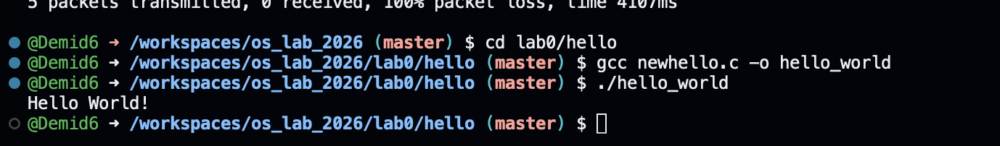

# Перейти в проект lab0 
cd lab0

# Создать папку hello
mkdir hello

# Создать внутри папки hello пустой файл empty
touch hello/empty

# Скопировать файл hello.c из src в папку hello
cp src/hello.c hello/

# Переименовать скопированный файл в newhello.c
mv hello/hello.c hello/newhello.c

# Находясь в корне проекта
./update.sh
# Проверка
ping ya.ru -c 5

# Перейдите в папку lab0/hello
cd lab0/hello

# Скомпилируйте newhello.c
gcc newhello.c -o hello_world

# Запустите исполняемый файл
./hello_world

